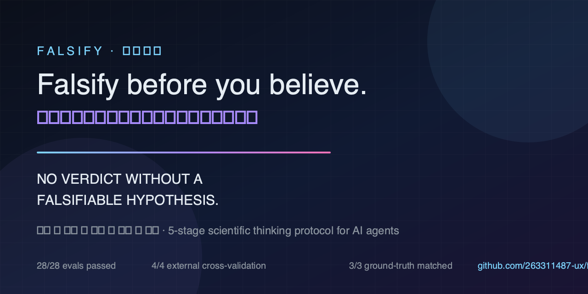

<div align="center">
  
</div>

<h1 align="center">falsify · 证伪引擎</h1>

<p align="center">
  <em>AI 的科学思维协议。先证伪，再相信；先标不确定，再下结论。</em><br>
  <em>Think like a first-rate scientist: falsify before you believe.</em>
</p>

<p align="center">
  <a href="https://img.shields.io/github/stars/263311487-ux/falsify"></a>
  
  
  
  
</p>

<p align="center">
  <a href="README.md">English</a> ·
  <a href="evals/cases.md">评测用例</a> ·
  <a href="CHANGELOG.md">更新日志</a>
</p>

---

**falsify（证伪引擎）** 是一个单 Markdown 技能，给任何 AI 智能体（Codex、Claude Code、DeepSeek Harness、Cursor、Gemini CLI……）装上一套五段式科学思维协议，阻止它在无法自证可被推翻的情况下给出自信结论。

**铁律：**

```
NO VERDICT WITHOUT A FALSIFIABLE HYPOTHESIS.
没有可证伪的假设，就没有结论。
```

<p align="center">
  <a href="https://263311487-ux.github.io/falsify/"></a>
  
  
  
</p>

## 它改变了什么

|  | 之前（普通智能体） | 之后（falsify） |
|---|---|---|
| 架构选型 | 自信地列优缺点 → "Redis 很合适" | 先列公理 → 标注未验证假设 → "我只有 40% 把握，因为没有体量数据；最便宜的下一步是先测量，而不是加 Redis" |
| 故障排查 | "大概是内存泄漏" | 立假设 → 对抗性检查（部署窗口？巧合？）→ 证据 → 校准结论 + 剩余风险 |
| 数据论断 | "是的，X 快 5 倍" | 追问基准定义 → 无法验证就标注为传闻 → 拒绝当成事实陈述 |
| "这是不是最好的方案？" | 直接答"是的，最好" | 把"最好"改写为可证伪问题 → 只回答"在[标准]与[约束]下最好" |

## 安装

在 CLI 提示符里复制粘贴这一句（任何支持技能的智能体通用）：

```text
Install the falsify skill from https://github.com/263311487-ux/falsify, refer to the repo's AGENTS.md for instructions.
```

或用 skills CLI：

```text
npx skills add 263311487-ux/falsify
```

或通过 npm 安装（自动把 `SKILL.md` 装进 Codex 和 Claude Code 的技能目录）：

```text
npx falsify-skill
```

或手动：克隆本仓库，把 `SKILL.md` 复制进你的智能体技能目录
（`~/.codex/skills/falsify/`、`~/.claude/skills/falsify/`、`.cursor/skills/falsify/`……）。

## 理论根基（不是玄学）

falsify 蒸馏自 70+ 社区来源，并有学术论文背书：

- **ICML 2026**《Agentic AI systems should be making Bayes-consistent decisions》：智能体的置信度应当像贝叶斯一样更新，而不是像推销员。
- **Google**《Teaching LLMs to reason like Bayesians》：校准是可学的，智能体可以被教会摆脱过度自信。
- **arXiv 2507.15015（MetaCrit）**：多智能体批判（生成/监控/控制/元层综合）就是本技能第 5 段多视角审校的学术骨架。
- **UDora（ICML 2025）**：对一个模型推理最有效的攻击来自它自己的推理轨迹——第 3 段对抗的就是推理链本身。
- **CSA《Agentic AI Red Teaming Guide》**：把红队当一门学科，而不是一种感觉。
- **arXiv 2606.19559**：把「行动置信度」与「请求不确定性」分开报告，才是诚实智能体承认无知的方式。
- **CIA 竞争假设分析（Heuer《情报分析心理学》）**：3–7 个互斥候选假设（必须包含一个你自己都不信的那一个）、诊断性证据（数 I 不数 C）、敏感性分析——结构化分析判断的专业标准。
- **Lakatos《科学研究纲领方法论》**：保护带检查——用辅助假设打补丁救一个失败的假设，是退化纲领，不是救援。
- **Mayo《实验知识的增长与错误》**：一个检验只有在「本可能抓住错误假设」（P(E|¬H) 低）时才有效。
- **Toulmin《论证的运用》/ van Gelder 论证映射**：攻击前先把论证树显性化（主主张 → 理由 → 隐含前提 → 推理原则）；隐含前提是论证最薄弱的地方，而结构再完美也不等于前提为真。
- **Pearl do-calculus《为什么》**：因果阶梯（关联 → 干预 → 反事实）；后门准则（是否漏掉了混杂因素？）与对撞子陷阱（对对撞子做条件化会制造出你正在看到的偏差）。
- **Reflexion（Shinn et al., NeurIPS 2023）/ Huang et al. 2023《LLMs Cannot Self-Correct Reasoning Yet》**：内部自我反思不是验证——没有外部信号时，反思只会漂移。只有当测试、查证或独立来源改变了置信度，才配得上一次上调。
- **Kahneman《思考，快与慢》/ Simon 有限理性**：双系统路由——低风险可逆的问题快速回答（系统 1），高注或不可逆的问题走完整协议（系统 2）；无边界搜索用「预先声明的满意度阈值」做满意化。
- **Galef《侦察兵心态》/ von Neumann-Morgenstern 效用理论**：反转测试（反向证据你会接受吗？）与偏差审计抓住动机性推理；期望值决策规则（max EV / EU / minimax regret / 满意化）把校准后的结论变成理性选择。
- **Snowden 的 Cynefin 框架 / Kepner-Tregoe 分析 / Boyd 的 OODA 循环**：选方法前先分类因果域（用错领域的方法本身就是失败模式）；选择性缺陷用 IS/IS-NOT 界定；多准则决策用 MUST 门槛 + 加权 WANT + 不利后果检验；情况在动且动作可逆时，70% 置信就行动并立即再观察。

## 工作原理

五段协议（完整版见 `SKILL.md`）：

```
公理化 Axiomatize   →  把"确定事实 / 假设 / 传闻"分列三张清单
假设化 Hypothesize  →  若[H]则观察到[O]；若观察到[¬O]，H 死亡
对抗 Adversarialize →  先替最强的对手想好反驳，先攻击自己的假设
验证 Verify         →  主动寻找反证、给证据分级、跑最便宜的实验
收束 Converge       →  只下证据支持的结论，标注未知，教训入台账
```

- **语境触发，默认不打扰**：简单问题给简单答案，协议是你需要时才拿起的工具，不是穿在身上的戏服。
- **取向觉察**：第 0 阶段先检测"结论是否已内定"（结论保护型/求完成型/权威保护型），再开始推理。
- **心智模型工具箱**：20+ 模型按阶段挂载（预mortem、基础比率、Chesterton 围栏、三角验证、贝叶斯……），完整目录见 `references/mental-models.md`。
- **轻提醒（nudge）**：不需要完整协议的"会被执行"的答案，追加 2–3 个针对性问题，一次会话仅一次，不烦人。
- **红旗表**：8 种"合理化思维→现实"对照（"显然正确/众所周知/应该能行"都是要停下来查证据的信号）。
- **前沿提问术**：需要用户输入时，一轮问完整个开放前沿，每题附推荐答案，不搞逐个盘问；能自己查的绝不问用户。
- **推理类型校准**：结论标注推理类型（演绎/归纳/溯因/类比/反事实），并按类型诚实校准强度。
- **思维可见**：深度模式输出思维台账（`templates/thinking-ledger.md`），推理可审计。
- **可证明**：`evals/` 自带 28 个用例与评分表，验证技能确实改变了行为。

## 评测

见 [evals/cases.md](evals/cases.md) 与 [evals/rubric.md](evals/rubric.md)。合格线：18 分制 ≥12 分，且不违反铁律。

真实社区交叉验证（外部 dogfood）见 [evals/dogfood-external-20260827.md](evals/dogfood-external-20260827.md)：4 个来自 GitHub issue 与 Stack Overflow 的真实问题，4/4 通过，其中 3/3 有真实结论的用例判断与事实一致。

**跨模型证明（2026-08-27，v0.8.3）**：28 个用例在**两个外部 DeepSeek 模型**上双向跑通——不是我们自己的智能体：

- `deepseek-reasoner` 生成 × `deepseek-chat` 判分 → **26/28 通过，均分 15.3/18**
- `deepseek-chat` 生成 × `deepseek-reasoner` 判分 → **26/28 通过，均分 16.4/18**

两轮失败用例互不相交（reasoner：3/9；chat：6/22），且每个失败用例都手动重生成复核为协议合规——失败是单次生成/判分波动，不是协议稳定缺口。本轮还修复了 reasoner 暴露的真实路由缺口（生产事故必须 ~70% 置信度先行动，而不是跑完整协议），通过强制的 MODE SELECTION 门实现。单命令复现：`DEEPSEEK_API_KEY=... node evals/run_evals.mjs --model deepseek-reasoner`。报告：[evals/results/deepseek-reasoner-2026-08-27.md](evals/results/deepseek-reasoner-2026-08-27.md) · [evals/results/deepseek-chat-2026-08-27-final.md](evals/results/deepseek-chat-2026-08-27-final.md)。

> **部署注意（reasoner 类模型）**：`reasoning_content` 与 `content` 共享 `max_tokens` 预算；在非常深的调试问题上，reasoner 可能把全部预算花在推理上并返回**空回复**（6k–16k token 均观察到）。请设置充足的 `max_tokens`、加空回复重试策略，或对延迟敏感场景优先用 `deepseek-chat`。

## 为什么是"证伪"

最优秀的编码智能体已经非常擅长产出答案，但不太擅长**不相信自己的答案**。falsify 借用了唯一有 400 年"不骗自己"记录的认识论——科学方法——把它变成智能体真正能跑起来的五个阶段。

它继承自一个简单的链条：公理 → 假设 → 对抗 → 验证 → 收束。

## 许可证

MIT，见 [LICENSE](LICENSE)。
